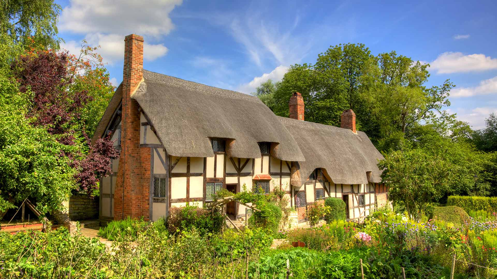
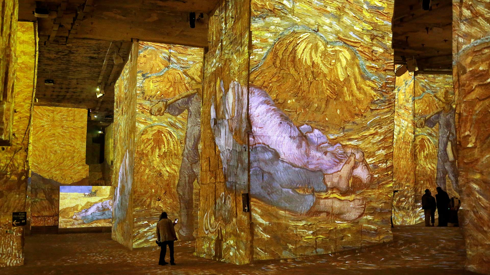
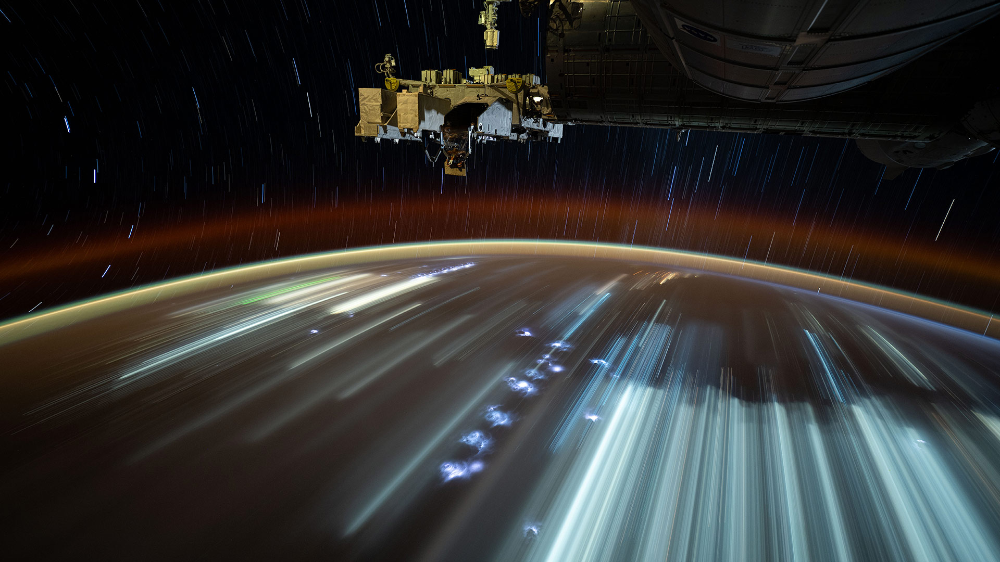
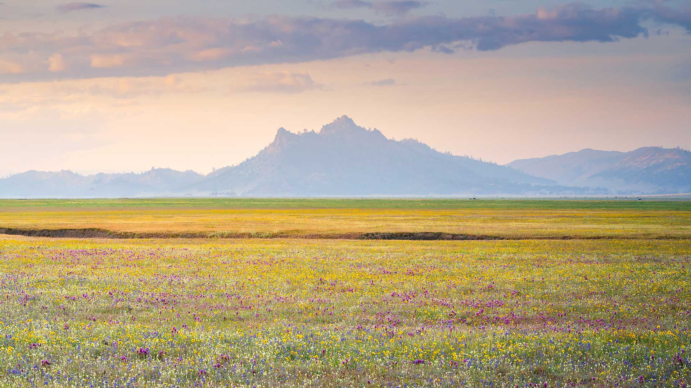

# Bing Wallpaper

Daily Automated Bing Wallpaper Scraping via Github Actions

picurl.py will create a DownloadedWallpapers folder in the current directory,
and save the downloaded wallpaper to that folder.

After cloning this repository to your local machine, you can run picurl.py to scrape wallpaper

## Photo Today

2026-04-28 [Download](./DownloadedWallpapers/2026-04-28.jpg)

## Photo Links from the Last 30 Days

|      |      |      |
| :----: | :----: | :----: |
|2026-04-28 [Download](./DownloadedWallpapers/2026-04-28.jpg)|2026-04-27 [Download](./DownloadedWallpapers/2026-04-27.jpg)|2026-04-26 [Download](./DownloadedWallpapers/2026-04-26.jpg)|
|2026-04-25 [Download](./DownloadedWallpapers/2026-04-25.jpg)|2026-04-24 [Download](./DownloadedWallpapers/2026-04-24.jpg)|2026-04-23 [Download](./DownloadedWallpapers/2026-04-23.jpg)|
|2026-04-22 [Download](./DownloadedWallpapers/2026-04-22.jpg)|2026-04-21 [Download](./DownloadedWallpapers/2026-04-21.jpg)|2026-04-20 [Download](./DownloadedWallpapers/2026-04-20.jpg)|
|2026-04-19 [Download](./DownloadedWallpapers/2026-04-19.jpg)|2026-04-18 [Download](./DownloadedWallpapers/2026-04-18.jpg)|2026-04-17 [Download](./DownloadedWallpapers/2026-04-17.jpg)|
|2026-04-16 [Download](./DownloadedWallpapers/2026-04-16.jpg)|2026-04-15 [Download](./DownloadedWallpapers/2026-04-15.jpg)|2026-04-14 [Download](./DownloadedWallpapers/2026-04-14.jpg)|
|2026-04-13 [Download](./DownloadedWallpapers/2026-04-13.jpg)|2026-04-12 [Download](./DownloadedWallpapers/2026-04-12.jpg)|2026-04-11 [Download](./DownloadedWallpapers/2026-04-11.jpg)|
|2026-04-10 [Download](./DownloadedWallpapers/2026-04-10.jpg)|2026-04-09 [Download](./DownloadedWallpapers/2026-04-09.jpg)|2026-04-08 [Download](./DownloadedWallpapers/2026-04-08.jpg)|
|2026-04-07 [Download](./DownloadedWallpapers/2026-04-07.jpg)|2026-04-06 [Download](./DownloadedWallpapers/2026-04-06.jpg)|2026-04-05 [Download](./DownloadedWallpapers/2026-04-05.jpg)|
|2026-04-04 [Download](./DownloadedWallpapers/2026-04-04.jpg)|2026-04-03 [Download](./DownloadedWallpapers/2026-04-03.jpg)|2026-04-02 [Download](./DownloadedWallpapers/2026-04-02.jpg)|
|2026-04-01 [Download](./DownloadedWallpapers/2026-04-01.jpg)|2026-03-31 [Download](./DownloadedWallpapers/2026-03-31.jpg)|2026-03-30 [Download](./DownloadedWallpapers/2026-03-30.jpg)|

