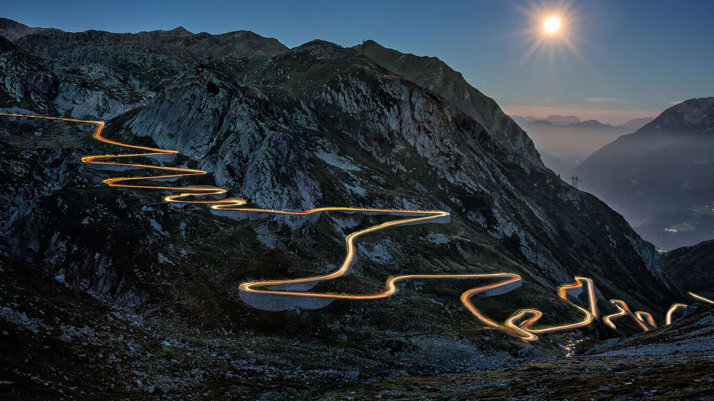
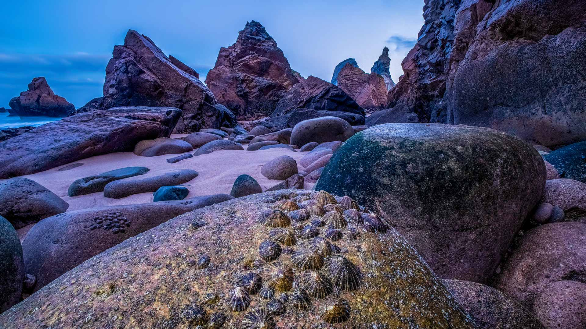
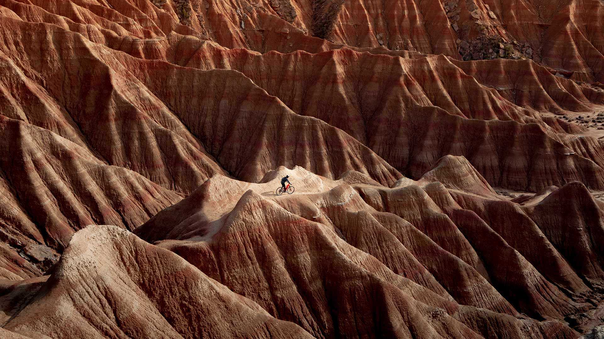
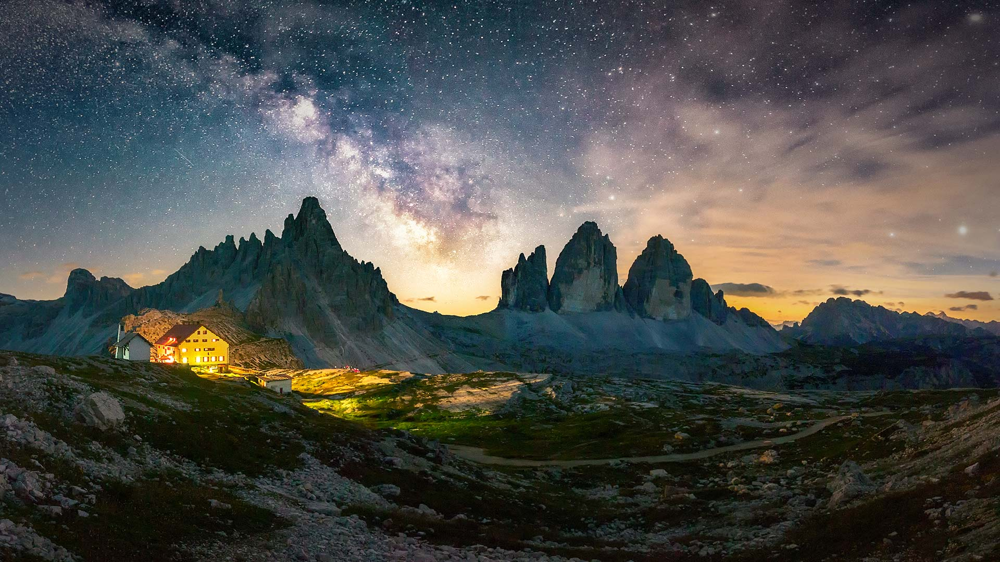
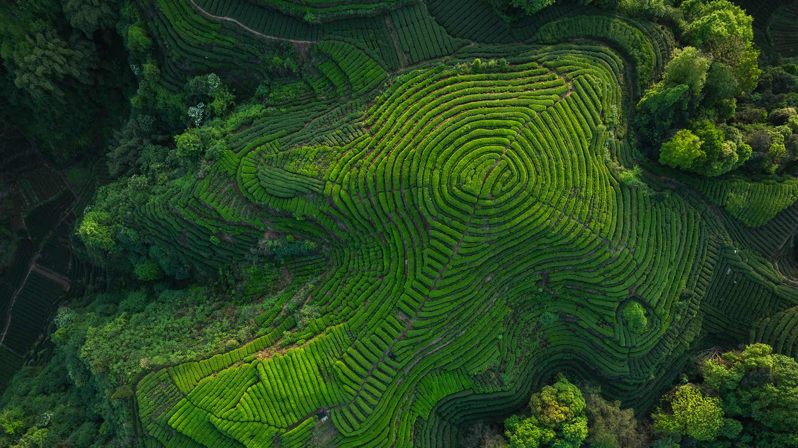

# Bing Wallpaper

Daily Automated Bing Wallpaper Scraping via Github Actions

picurl.py will create a DownloadedWallpapers folder in the current directory,
and save the downloaded wallpaper to that folder.

After cloning this repository to your local machine, you can run picurl.py to scrape wallpaper

## Photo Today

2026-06-18 [Download](./DownloadedWallpapers/2026-06-18.jpg)

## Photo Links from the Last 30 Days

|      |      |      |
| :----: | :----: | :----: |
|2026-06-18 [Download](./DownloadedWallpapers/2026-06-18.jpg)|2026-06-17 [Download](./DownloadedWallpapers/2026-06-17.jpg)|2026-06-16 [Download](./DownloadedWallpapers/2026-06-16.jpg)|
|2026-06-15 [Download](./DownloadedWallpapers/2026-06-15.jpg)|2026-06-14 [Download](./DownloadedWallpapers/2026-06-14.jpg)|2026-06-13 [Download](./DownloadedWallpapers/2026-06-13.jpg)|
|2026-06-12 [Download](./DownloadedWallpapers/2026-06-12.jpg)|2026-06-11 [Download](./DownloadedWallpapers/2026-06-11.jpg)|2026-06-10 [Download](./DownloadedWallpapers/2026-06-10.jpg)|
|2026-06-09 [Download](./DownloadedWallpapers/2026-06-09.jpg)|2026-06-08 [Download](./DownloadedWallpapers/2026-06-08.jpg)|2026-06-07 [Download](./DownloadedWallpapers/2026-06-07.jpg)|
|2026-06-06 [Download](./DownloadedWallpapers/2026-06-06.jpg)|2026-06-05 [Download](./DownloadedWallpapers/2026-06-05.jpg)|2026-06-04 [Download](./DownloadedWallpapers/2026-06-04.jpg)|
|2026-06-03 [Download](./DownloadedWallpapers/2026-06-03.jpg)|2026-06-02 [Download](./DownloadedWallpapers/2026-06-02.jpg)|2026-06-01 [Download](./DownloadedWallpapers/2026-06-01.jpg)|
|2026-05-31 [Download](./DownloadedWallpapers/2026-05-31.jpg)|2026-05-30 [Download](./DownloadedWallpapers/2026-05-30.jpg)|2026-05-29 [Download](./DownloadedWallpapers/2026-05-29.jpg)|
|2026-05-28 [Download](./DownloadedWallpapers/2026-05-28.jpg)|2026-05-27 [Download](./DownloadedWallpapers/2026-05-27.jpg)|2026-05-26 [Download](./DownloadedWallpapers/2026-05-26.jpg)|
|2026-05-25 [Download](./DownloadedWallpapers/2026-05-25.jpg)|2026-05-24 [Download](./DownloadedWallpapers/2026-05-24.jpg)|2026-05-22 [Download](./DownloadedWallpapers/2026-05-22.jpg)|
|2026-05-21 [Download](./DownloadedWallpapers/2026-05-21.jpg)|2026-05-20 [Download](./DownloadedWallpapers/2026-05-20.jpg)|

